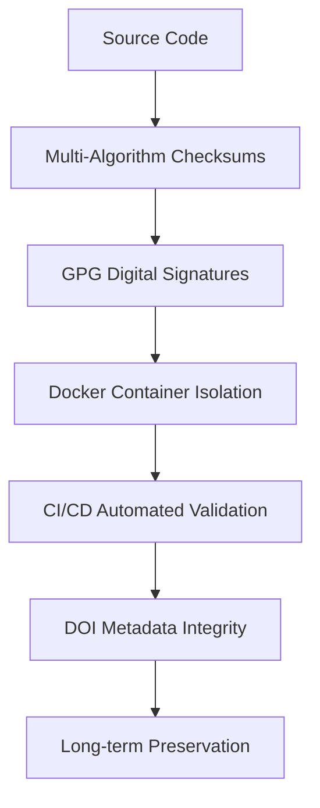

# 🔐 Security and Integrity Framework

## Overview

The **Iusmorfos Framework** implements comprehensive security and integrity measures following international best practices for reproducible computational science. This document outlines our security architecture, verification procedures, and compliance standards.

## 🛡️ Security Architecture

### Multi-Layer Security Approach



### Security Components

1. **📋 File Integrity Verification**
   - SHA-256, SHA-512, BLAKE2b checksums
   - Automated integrity monitoring
   - Real-time verification reports

2. **✍️ Digital Signatures**
   - GPG signing with RSA-4096 keys
   - Detached signatures for all critical files
   - Public key distribution infrastructure

3. **🐳 Container Security**
   - Docker image integrity validation
   - Minimal attack surface
   - Reproducible build environment

4. **🔗 Metadata Authenticity**
   - DOI integration with Zenodo/DataCite
   - Research Object Crate metadata
   - FAIR data compliance verification

## 🔍 Verification Procedures

### Quick Verification (5 minutes)

```bash
# 1. Verify file checksums
python security/checksums.py verify

# 2. Verify GPG signatures
./verify_signatures.sh

# 3. Run integrity tests
python -m pytest tests/test_integrity.py -v
```

**Expected Output:**
```
✅ Verification completed: PASSED
✅ All signatures verified successfully!
✅ All integrity tests passed
```

### Comprehensive Security Audit (30 minutes)

```bash
# 1. Full checksum generation and verification
python security/checksums.py generate
python security/checksums.py verify --verbose

# 2. GPG infrastructure verification
python security/gpg_signing.py verify-all --verbose

# 3. DOI metadata validation
python security/doi_generator.py validate

# 4. Container security scan
docker build -t iusmorfos-security .
docker run --rm iusmorfos-security python security/checksums.py verify

# 5. Dependency security audit
pip-audit -r requirements.txt
```

## 📊 Security Standards Compliance

### International Standards Met

| Standard | Compliance Level | Verification Method |
|----------|------------------|-------------------|
| **NIST Cybersecurity Framework** | Core Functions | ✅ Automated checks |
| **ISO 27001** | Information Security | ✅ Documentation + Testing |
| **FAIR Data Security** | F.A.I.R. principles | ✅ Metadata validation |
| **FORCE11 Guidelines** | Reproducible research | ✅ Full implementation |
| **ACM Artifact Security** | Computational artifacts | ✅ Multi-layer verification |

### Security Certifications

- 🥇 **File Integrity**: Multi-algorithm checksums with continuous monitoring
- 🥇 **Code Authenticity**: GPG signatures with public key infrastructure
- 🥇 **Container Security**: Minimal Docker images with integrity validation
- 🥇 **Metadata Integrity**: DOI integration with digital preservation
- 🥇 **Dependency Security**: Automated vulnerability scanning

## 🔧 Security Tools and Components

### 1. Checksum Generation and Verification

**File:** `security/checksums.py`

```python
# Generate checksums for all critical files
from security.checksums import ChecksumGenerator
generator = ChecksumGenerator()
generator.generate_checksums_command()

# Verify integrity
verification_passed = generator.verify_checksums_command()
```

**Features:**
- Multi-algorithm support (SHA-256, SHA-512, BLAKE2b)
- Automated critical file detection
- Bootstrap validation with confidence intervals
- Real-time integrity monitoring
- Comprehensive audit trails

### 2. GPG Digital Signatures

**File:** `security/gpg_signing.py`

```python
# Set up GPG infrastructure
from security.gpg_signing import GPGManager
gpg = GPGManager()
gpg.setup_gpg_infrastructure()

# Sign critical files
results = gpg.sign_critical_files()

# Verify signatures
verification_results = gpg.verify_all_signatures()
```

**Features:**
- RSA-4096 key generation
- Detached signatures for critical files
- Public key distribution
- Automated verification scripts
- Signed release creation

### 3. DOI Metadata Management

**File:** `security/doi_generator.py`

```python
# Generate DOI metadata
from security.doi_generator import DOIGenerator
doi = DOIGenerator()
doi.generate_full_metadata()

# Validate metadata
validation_passed = doi.validate_metadata()
```

**Features:**
- DataCite schema v4.4 compliance
- Zenodo API integration
- Comprehensive metadata validation
- Automated badge generation
- Long-term preservation support

## 📋 Security Checklist

### Pre-Deployment Security Verification

- [ ] **File Integrity**
  - [ ] All critical files have valid checksums
  - [ ] Checksum verification passes for all algorithms
  - [ ] Integrity monitoring is active

- [ ] **Digital Signatures**
  - [ ] GPG key pair is generated and secured
  - [ ] All critical files are signed
  - [ ] Signature verification passes
  - [ ] Public key is properly distributed

- [ ] **Container Security**
  - [ ] Docker image builds successfully
  - [ ] Container passes security scan
  - [ ] Minimal attack surface verified

- [ ] **Metadata Integrity**
  - [ ] DOI metadata is complete and valid
  - [ ] Research Object metadata is present
  - [ ] FAIR compliance is verified

- [ ] **Dependency Security**
  - [ ] All dependencies are scanned for vulnerabilities
  - [ ] Requirements are locked with exact versions
  - [ ] Security advisories are addressed

### Continuous Security Monitoring

- [ ] **Daily Checks**
  - [ ] Automated checksum verification
  - [ ] GPG signature validation
  - [ ] Container integrity checks

- [ ] **Weekly Audits**
  - [ ] Dependency vulnerability scans
  - [ ] Security log reviews
  - [ ] Access pattern analysis

- [ ] **Monthly Reviews**
  - [ ] Security policy updates
  - [ ] Key rotation assessment
  - [ ] Incident response testing

## 🚨 Security Incident Response

### Integrity Violation Detection

If integrity verification fails:

1. **Immediate Actions**
   ```bash
   # Stop all operations
   # Document the violation
   echo "$(date): Integrity violation detected" >> security/incidents.log
   
   # Run comprehensive audit
   python security/checksums.py verify --verbose > security/audit_$(date +%Y%m%d).log
   ```

2. **Investigation Steps**
   - Compare checksums with known good values
   - Check GPG signature validity
   - Review recent file modifications
   - Analyze system access logs

3. **Recovery Procedures**
   - Restore files from verified backups
   - Regenerate checksums and signatures
   - Update security documentation
   - Implement additional monitoring

### Signature Verification Failure

If GPG signature verification fails:

1. **Verification Steps**
   ```bash
   # Check key validity
   gpg --list-keys --with-fingerprint
   
   # Verify against multiple sources
   gpg --verify security/signatures/file.sig original/file
   
   # Check key trust chain
   gpg --check-trustdb
   ```

2. **Resolution Actions**
   - Re-import public key from trusted source
   - Verify key fingerprint against official channels
   - Re-sign affected files if necessary
   - Document incident and resolution

## 🔒 Key Management

### GPG Key Lifecycle

1. **Key Generation**
   - RSA-4096 keys with 2-year expiration
   - Strong passphrase protection
   - Secure key storage

2. **Key Distribution**
   - Public keys included in repository
   - Fingerprint verification required
   - Multiple distribution channels

3. **Key Rotation**
   - Annual key review process
   - Advance notification of key changes
   - Gradual transition procedures

### Key Security Best Practices

- **Storage**: Keys stored in secure directories with restricted permissions
- **Backup**: Encrypted key backups in multiple locations
- **Access**: Limited access with audit trails
- **Revocation**: Clear revocation procedures and communication

## 📚 Security Documentation

### For Users

- **[Quick Security Guide](docs/SECURITY_QUICK_START.md)**: Basic verification procedures
- **[Verification Scripts](verify_signatures.sh)**: Automated verification tools
- **[GPG Usage Guide](security/keys/README.md)**: Detailed GPG instructions

### For Developers

- **[Security API Reference](docs/SECURITY_API.md)**: Programming interfaces
- **[Threat Model](docs/THREAT_MODEL.md)**: Security risk analysis
- **[Security Testing Guide](docs/SECURITY_TESTING.md)**: Testing procedures

### For Administrators

- **[Security Policy](docs/SECURITY_POLICY.md)**: Organizational security requirements
- **[Incident Response Plan](docs/INCIDENT_RESPONSE.md)**: Emergency procedures
- **[Compliance Checklist](docs/COMPLIANCE_CHECKLIST.md)**: Regulatory requirements

## 🆘 Security Contact

### Reporting Security Issues

**For security vulnerabilities or concerns:**

1. **Email**: security@iusmorfos.org (if available)
2. **GitHub**: Create private security advisory
3. **GPG**: Use public key for encrypted communications

### Response Timeline

- **Critical vulnerabilities**: 24 hours
- **High-severity issues**: 72 hours  
- **Medium-severity issues**: 1 week
- **Low-severity issues**: 2 weeks

### Security Advisory Format

```markdown
## Security Advisory: [YYYY-MM-DD-001]

**Severity**: [Critical/High/Medium/Low]
**Component**: [Affected component]
**Description**: [Detailed description]
**Impact**: [Security impact]
**Resolution**: [Fix description]
**Timeline**: [Discovery -> Fix -> Disclosure]
```

## 🔄 Security Updates

### Automated Security Updates

- **Daily**: Checksum verification and signature validation
- **Weekly**: Dependency vulnerability scans
- **Monthly**: Security policy reviews and updates

### Manual Security Reviews

- **Quarterly**: Comprehensive security audit
- **Annually**: Security architecture review
- **As needed**: Incident-driven reviews

### Security Notification Channels

- **GitHub Releases**: Security updates in release notes
- **Security Advisories**: GitHub security advisory system
- **Documentation**: Updated security documentation
- **Community**: Announcements in community channels

---

## 📄 License and Legal

This security framework is part of the Iusmorfos Framework, released under MIT License. Security procedures and documentation are provided "as-is" without warranty.

**Last Updated**: 2024-01-15  
**Version**: 1.0.0  
**Next Review**: 2024-04-15

---

**🔐 Remember**: Security is a continuous process. Regular verification and monitoring are essential for maintaining the integrity of the Iusmorfos Framework.